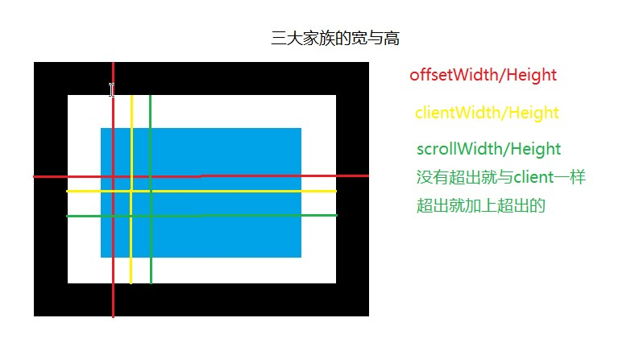
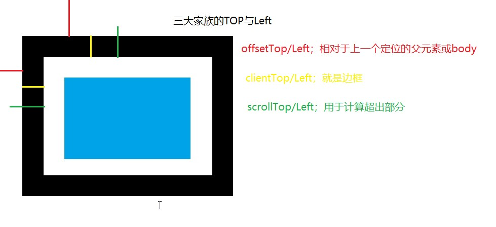

#  55 三大家族

## 01 之前获取元素宽高的方法

```css
    *{
        margin: 0;
        padding: 0;
    }
    div{
        width: 100px;
        height: 100px;
        padding: 50px;
        border: 50px solid #000;
        background: red;
        background-clip: content-box;
    }
```
```html
<div id="box"></div>
```


1. getComputedStyle方法

   1. 获取的宽高不包括 边框和内边距。
   2. 即可以获取行内设置的宽高也可以获取CSS设置的宽高。
   3. 只支持获取，不支持设置。
   4. 只支持IE9及以上浏览器。

   ```javascript
   var oDiv = document.getElementById("box");
   // oDiv.style.width = "166px";
   // oDiv.style.height = "166px";
   var style = getComputedStyle(oDiv);
   // style.width = "166px";//报错
   // style.height = "166px";//报错
   console.log(style.width);
   console.log(style.height);
   ```

2. 通过currentStyle属性获取宽高
   1. 获取的宽高不包括 边框和内边距
   2. 即可以获取行内设置的宽高也可以获取CSS设置的宽高
   3. 只支持获取, 不支持设置
   4. 只支持IE9以下浏览器
   
   ```javascript
   var oDiv = document.getElementById("box");
   // oDiv.style.width = "166px";
   // oDiv.style.height = "166px";
   var style = oDiv.currentStyle;
   style.width = "166px";
   style.height = "166px";
   // console.log(style);
   console.log(style.width);
   console.log(style.height);
   ```


3. 通过style属性获取宽高
	1. 获取的宽高不包括 边框和内边距
	2. 只能获取内设置的宽高, 不能获取CSS设置的宽高
	3. 可以获取也可以设置
	4. 高级低级浏览器都支持
	
	```
	var oDiv = document.getElementById("box");
	oDiv.style.width = "166px";
	oDiv.style.height = "166px";
	console.log(oDiv.style.width);
	console.log(oDiv.style.height);
	```

## 02 offsetWidth/Height


1. 获取的宽高包含 边框 + 内边距 + 元素宽高，不包括margin（外边框）
2. 即可以获取行内设置的宽高也可以获取CSS设置的宽高
3. 只支持获取, 不支持设置
4. 高级低级浏览器都支持

```
var oDiv = document.getElementById("box");
// oDiv.offsetWidth = "166px";
// oDiv.offsetHeight = "166px";
oDiv.style.width = "166px";
oDiv.style.height = "166px";
console.log(oDiv.offsetWidth);
console.log(oDiv.offsetHeight);
```
```css
    *{
        margin: 0;
        padding: 0;
    }
    div{
        width: 100px;
        height: 100px;
        padding: 50px;
        border: 50px solid #000;
        background: red;
        background-clip: content-box;
    }
```
```html
<div id="box"></div>
```

## 03 总结

```
1.getComputedStyle/currentStyle/style
获取的宽高不包括 边框和内边距
2.offsetWidth/offsetHeight
获取的宽高包括 边框和内边距

3.getComputedStyle/currentStyle/offsetXXX
只支持获取, 不支持设置
4.style
可以获取, 也可以设置

5.getComputedStyle/currentStyle/offsetXXX
即可以获取行内,也可以获取外链和内联样式
6.style
只能获取行内样式
```

## 04 offsetLeft/Top

```javascript
/*
1.offsetLeft和offsetTop作用
获取元素到第一个**定位（有定位的）**祖先元素之间的偏移位
如果没有祖先元素是定位的, 那么就是获取到body的偏移位
*/
let oSDiv = document.querySelector(".son");
oSDiv.onclick = function () {
    console.log(oSDiv.offsetLeft);
    console.log(oSDiv.offsetTop);
}

/*
2.课后练习
按照offsetWidth和offsetHeight讲解思路, 自己整理offsetLeft/marginLeft/left异同
*/
```

```css
*{
    margin: 0;
    padding: 0;
}
.father{
    width: 200px;
    height: 200px;
    margin-top: 100px;
    margin-left: 100px;
    background: blue;
    overflow: hidden;
    position: relative;
}
.son{
    width: 100px;
    height: 100px;
    margin-top: 100px;
    margin-left: 100px;
    background: red;
}
```

```html
<div class="father">
    <div class="son"></div>
</div>
```

## 05 offsetParent

```javascript
/*
1.offsetParent作用
获取元素的第一个定位祖先元素
如果没有祖先元素是定位的, 那么就是获取到的就是body
*/
let oSDiv = document.querySelector(".son");
oSDiv.onclick = function () {
    console.log(oSDiv.offsetParent);
}
```

```html
<div class="grand-father">
    <div class="father">
        <div class="son"></div>
    </div>
</div>
```

```css
*{
    margin: 0;
    padding: 0;
}
.grand-father{
    width: 300px;
    height: 300px;
    margin-top: 100px;
    margin-left: 100px;
    background: deeppink;
    overflow: hidden;
    position: relative;
}
.father{
    width: 200px;
    height: 200px;
    margin-top: 100px;
    margin-left: 100px;
    background: blue;
    overflow: hidden;
    position: relative;
}
.son{
    width: 100px;
    height: 100px;
    margin-top: 100px;
    margin-left: 100px;
    background: red;
}
```

## 06 client

内容包括clientWidth，clientHeight，clientTop，clientLeft

```JavaScript
/*
1.offsetWidth = 宽度 + 内边距 + 边框
 offsetHeight = 高度 + 内边距 + 边框
2.clientWidth = 宽度 + 内边距
 clientHeight = 高度 + 内边距
*/
let oDiv = document.querySelector("div");
// console.log(oDiv.clientWidth);
// console.log(oDiv.clientHeight);

/*
1.offsetLeft/offsetTop: 距离第一个定位祖先元素偏移位 || body
2.clientLeft/clientTop: 左边框 和 顶部边框
*/
console.log(oDiv.clientLeft);
console.log(oDiv.clientTop);
oDiv.scrollWidth
```

```html
<div id="box"></div>
```

```css
*{
    margin: 0;
    padding: 0;
}
div{
    width: 100px;
    height: 100px;
    padding: 50px;
    border: 50px solid #000;
    background: red;
    background-clip: content-box;
}
```

## 07 scroll

```javascript
/*
1.内容没有超出元素范围时
scrollWidth: = 元素宽度 + 内边距宽度 == clientWidth
scrollHeight: = 元素高度 + 内边距的高度 == clientHeight
*/
let oDiv = document.querySelector("div");
// console.log(oDiv.scrollWidth);
// console.log(oDiv.scrollHeight);
/*
2.内容超出元素范围时
scrollWidth: = 元素宽度 + 内边距宽度 + 超出的宽度
scrollHeight: = 元素高度 + 内边距的高度 + 超出的高度
*/

/*
3.scrollTop / scrollLeft
scrollTop: 超出元素内边距顶部的距离
scrollLeft: 超出元素内边距左边的距离
*/
// console.log(oDiv.scrollTop);
oDiv.onscroll = function () {
    console.log(oDiv.scrollTop);
}
```

```html
<div id="box">
    我是内容<br/>
    我是内容<br/>
    我是内容<br/>
    我是内容<br/>
    我是内容<br/>
    我是内容<br/>
    我是内容<br/>
    我是内容<br/>
    我是内容<br/>
    我是内容<br/>
    我是内容<br/>
    我是内容<br/>
    我是内容<br/>
    我是内容<br/>
</div>
```

## 08 大总结





**注**：黑色的是border，白色的是padding


## 09 新学到的

用途：**iscroll插件中计算歌词位置**

使用 CSS3 translate 属性和绝对定位、相对定位属性加上 top、left 数值都可以使元素产生位移，但存在细微差别，表现在offsetLeft 和 offsetTop 属性。

使用绝对定位、相对定位属性加上 top、left ，会影响offsetTop和 offsetLeft 的值；

使用 translate 的offsetTop和 offsetLeft 与没有产生位移的元素没有区别，即无论translate 的值为多少，这offsetTop和 offsetLeft 的值都是固定不变的。

